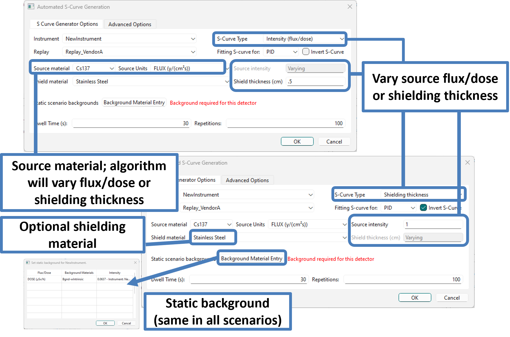

.. _automatic_s_curve_generation:

###############################
Automatic S-curve generation
###############################

Generation of an S-curve requires creating a set of scenarios with a range of dose rates/fluxes
where the identification metric (PID, C&C, etc.) goes from 0% to 100% (or 100% to 0%, in the case of
an inverse S-curve). The automatic S-curve tool removes the burden of finding the range of
intensities where this transition happens. It first searches the range automatically using many
low-statistics scenarios, then fills that range with several evenly spaced high-statistics scenarios.

Access the Automated S-curve GUI from the "Tools" menu. The GUI has two tabs. You only need to use
the main tab; settings in the "Advanced Options" tab are optional. On the main tab, fill the
following fields:

-  An instrument must be selected before anything else. This selection limits which materials will
   populate the source and background options. Note that only instruments with command line replay
   tools will appear as options for the automated S-curve.

-  The material selected in the source drop-down menu will have its intensity automatically varied
   to generate the S-curve.

-  Background sources are optional. Add any number of desired background sources. The intensity
   of background sources are not varied.

-  Dwell time is used during range finding and in the final high-statistics scenarios.

-  Replications sets how many replications will be present in the final high-statistics scenarios.
   The scenarios generated by the automated S-curve tool can be handled like any other,
   including viewing the results, plotting, changing scenario groups, etc.

-  The Invert S-curve option makes the algorithm search for a range of scenarios where the isotope
   identification rate decreases as the source intensity increases.

-  Shielding materials and thickness are optional. By default, no shielding is applied.

By default, auto S-curves vary flux or dose. You can apply either zero shielding or a fixed amount
of shielding. You can also generate S-curves by varying shielding thickness while keeping flux or
dose fixed. To select the S-curve mode, use the "S-curve type" drop-down box. If you choose
"Shielding thickness," the "Invert S-Curve" checkbox is automatically selected.

The "Advanced Options" fields come with presets. Hover the mouse over an option to see a pop-up with
more details.

.. _rase-AutoSCurve:

    **“Auto S-Curve” dialog.**
