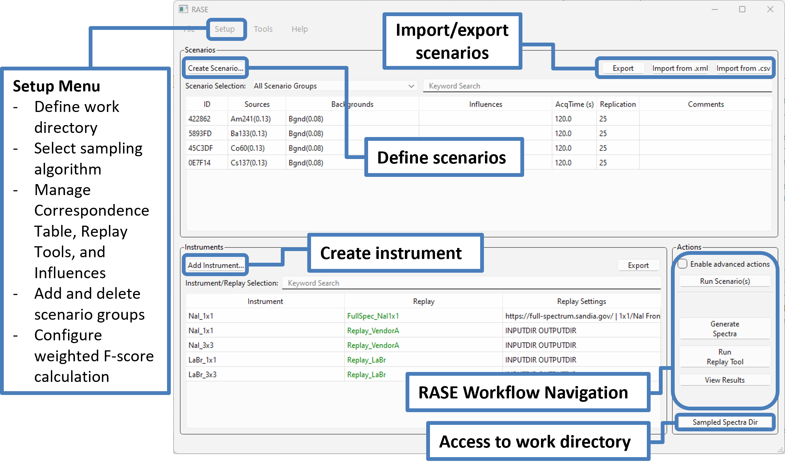

.. _mainwindow:

###############################
 RASE main window and settings
###############################

The RASE main window appears when the executable is launched, and is depicted in the figure below.

Prior to executing the RASE workflow, define a custom work directory where
the RASE-generated data (sampled spectra, replay tool outputs, and analysis reports) will be
stored. Set the work directory in the “Preferences” dialog, accessible from the
“Setup” menu. The default location of data for Windows machines is
``C:\\Windows\\Users\\[UserName]\\RaseData``. If you modify the RASE work directory, restart RASE for the change to take effect.

Access the RASE work directory at any time from the main window by clicking
the “Sample Spectra Dir” button in the bottom-right corner.

Choose the sampling algorithm in the "Preferences" dialog under the "Setup"
menu. You can change this at any stage of the analysis workflow. Other options in
the “Setup” menu include Replay Tool, Correspondence Table, and scenario groups management.
Like the sampling algorithm, these can be accessed and modified at any stage of the workflow.

The "Tools" menu contains add-on functionality (some features are under development)
to extend RASE capabilities. These include:

   -  Fix the random seed number in order to generate identical spectra sets on different
      machines (for example, for a parallel independent analysis)
   -  Convert spectra sourced from measurements and convert them into RASE-consumable base
      spectra formats
   -  Shielded base spectra creation
   -  Automate S-curve creation, where an isotope identification vs flux/dose curve is generated
      automatically based on source and background material selection

The capability to model dynamic, in-motion measurement scenarios is also under development.

The main window provides access to the instrument and scenario definitions.
Once these are defined, run the RASE workflow steps using the buttons in the bottom-right
"Actions" area.

Materials that make up scenarios are shown in plain text, italics, or a combination of both.
Materials in plain text are in units of dose rate (:math:`{\mu}`\ Sv/h), while those in
italics are in units of flux (gammas/cm\ :sup:`2`\ s).

The color-coding of the alphanumeric scenario IDs in the main window indicates workflow progress.
Color-coding is active when an instrument is selected:

-  Black: the scenario was defined, but sample spectra have not yet been generated.
-  Orange: Sample spectra have been generated for this instrument and scenario combination. The
   replay tool has not yet been executed.
-  Green: The replay tool and translator (if applicable) have been successfully executed for this
   instrument and scenario combination.
-  Red: The selected instrument does not have base spectra for all of the sources that are defined
   in the scenario.

Instruments are color coded using black, orange, and green with the same criteria as scenarios.
If you select multiple instruments, each scenario's color is determined by the instrument that
has progressed the least through the workflow. The same logic applies when multiple scenarios are
selected: an instrument's color reflects the selected scenario that has executed the least of
the workflow with that instrument.

The replay tool uses a simpler color scheme: the name is green if a command line replay tool
executable is defined and the command line checkbox is checked. Otherwise, it is black.

|

.. _rase_mainwindow:

   **RASE main window at the first start without pre-defined instruments or scenarios.**