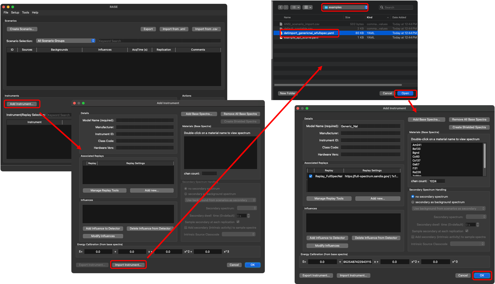
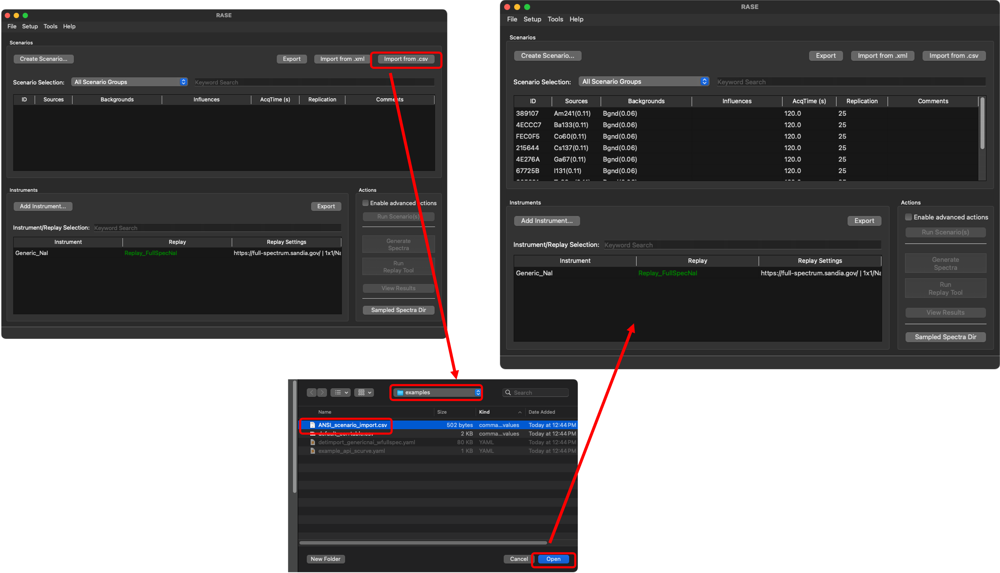
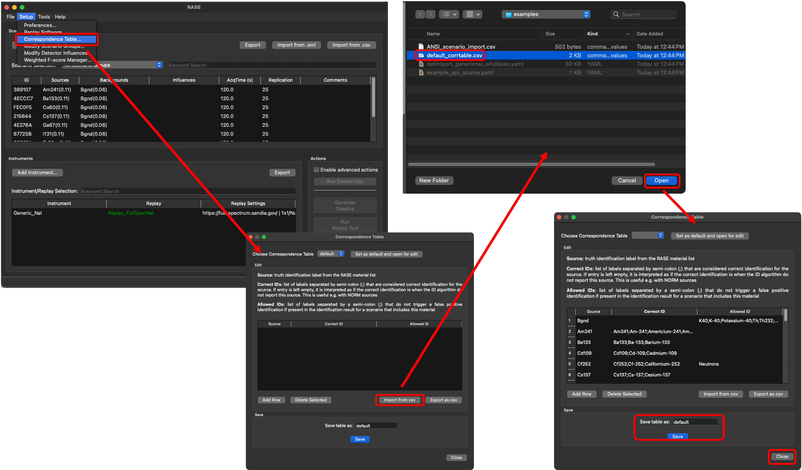

.. _quickstart:

###################
 Quick start guide
###################

**************
 Distribution
**************

RASE is distributed as an executable; all GUI features are available from the executable. To
access the RASE API, you must have an up-to-date Python installation and the most recent RASE
codebase, available at https://github.com/LLNL/RASE. Example API scripts are found in
the ``examples`` directory.

*****************************
 Pregenerated workflow setup
*****************************

RASE includes a preconfigured instrument, a list of scenarios, and a correspondence table to
help you get started quickly. Follow the steps below to have a
functional workflow within minutes.

Quick instrument setup
======================

From the main window, click the "Add Instrument" button to open the detector dialog. Select "Import
Instrument" and load the pre-configured detector file ``detimport_genericnai_wfullspec.yaml`` from
the examples folder. This loads a detector pre-populated with spectra simulated for a generic
2x2 NaI(Tl) detector. It also loads a pre-generated FullSpec WebID replay tool; this must be
attached to the detector by clicking the checkbox in the detector window after the information is
loaded.

   **Procedure to load in the pre-generated detector distributed with RASE.**

Quick scenario setup
====================

From the main window, click the "Import from .csv" button near the top-right. Select the
``ANSI_scenario_import.csv`` file and accept. This populates the scenario list with the ANSI
standard for several sources.

   **Procedure to load in the pre-generated scenarios distributed with RASE.**

Quick correspondence table setup
================================

From the main window, select "Setup --> Correspondence Table" to open the correspondence table
dialog. Click the "Import from .csv" button, select ``default_corrtable.csv``, and accept. This
loads the pre-generated correspondence table into RASE. Enter a name to save the table
as (such as "default") and close the dialog.

   **Procedure to load in the pre-generated Correspondence Table distributed with RASE.**

..
   quickstart: