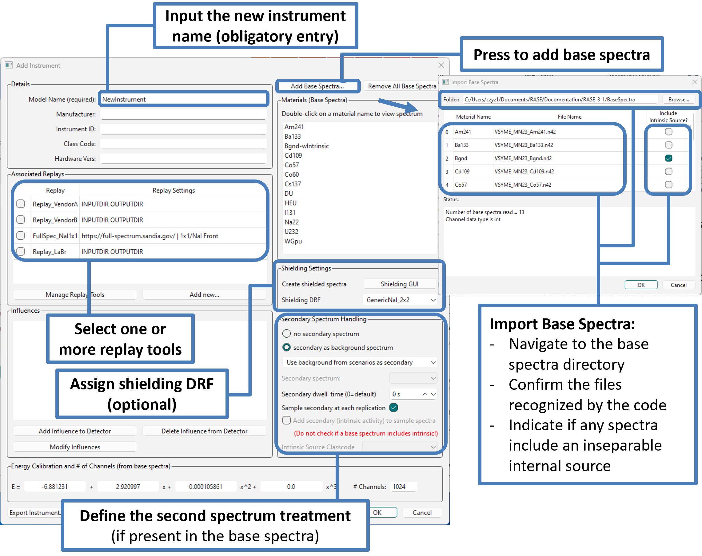

.. _workflowstep1:

#############################################
 RASE workflow step 1: Instrument definition
#############################################

The “Add Instrument” dialog (Figure below) opens when you click the “Add Instrument...”
button in the main RASE window.

Enter a unique name for the instrument in the top-left field. All other entries in this area are
optional.

To add base spectra, click the “Add Base Spectra” button in the dialog's top-right. In the popup,
navigate to the directory containing the base spectra in .n42 format and click “Select Folder”.
Review the metadata and import details, then click “OK”.

Some replay tools require secondary spectra, for example pre-recorded background, internal source,
or calibration spectra. RASE automatically recognizes and imports any secondary spectral data found
in the base spectra files. RASE expects each spectrum to have one of five class codes:

   1: Foreground

   2: Background

   3: Calibration

   4: IntrinsicActivity

   5: NotSpecified

If multiple spectra share the same class code, RASE uses the first one encountered. If a
measurement lacks a class code, RASE assigns "UnspecifiedSecondary". RASE assumes all imported
base spectra share identical secondary spectra and therefore saves only the secondary spectra from
the first base spectrum file.

Select how to handle secondary spectra using the radio buttons in the "Secondary Spectrum Handling"
group box at the dialog's bottom left. Choose "no secondary spectrum" to exclude secondary spectra
from generated synthetic spectra. Choose "secondary as background spectrum" to use a secondary
spectrum as the instrument background. If you select the latter, specify one of three sources:

   1: Select one of the base spectra associated with the detector to serve as the secondary
   spectrum. Use this when a specific background was acquired before the measurement campaign,
   possibly at a different location with a different background.

   2: Populate the secondary spectrum automatically from the background(s) defined in a "scenario"
   (combinations of sources and backgrounds paired with an instrument to simulate spectra;
   scenarios are described in the next section). If you define multiple background sources, RASE
   combines them weighted by their specified intensities. This produces a secondary spectrum that
   differs per scenario. If you choose this option, you cannot run a scenario without a defined
   background.

   3: Copy one of the secondary spectra included in the base spectra files. After selecting this
   option, choose the spectrum class code in the "Secondary spectrum" drop-down menu.

You can also specify the dwell time for the background spectrum and enable Poisson resampling of
the background for each generated spectrum.

If the instrument includes an internal source, check "Add secondary (intrinsic activity) to sample
spectra". RASE will sample and scale the spectrum associated with the class code chosen in the
"Intrinsic Source Class code" dropdown (scaling uses scenario acquisition time) and add it to any
generated sample spectra, in addition to scenario sources. The secondary spectrum must represent the
calibration source alone, without additional background. If the internal source measurement includes
background or was measured with a different detector and cannot be separated, follow the guidance in
the ":ref:`intrinsic_source_handling`" section.

If the base spectra have a channel count that matches with the shielding matrices included in the
RASE distribution (currently 512, 1024, 2048, and 3000 channels), a detector response function (DRF)
is automatically selected from the shielding configuration file and assigned to the instrument. This
DRF is used only when generating shielded spectra for scenarios that include shielding (see
":ref:`shielding_generation`" for more information on applying shielding in RASE). If multiple
DRFs are available for the base spectra channel count, you can select between them using the
drop-down menu.

After loading base spectra, review them by double-clicking a material name in the "Edit Detector"
dialog. A plotting dialog will appear.

You can modify all other entries in the "Add Instrument" dialog later in the workflow; they are
documented elsewhere.

****************************************************************
 NOTE: Detectors using base spectra with different calibrations
****************************************************************

RASE allows attaching base spectra with different energy calibrations to a single detector.
The detector's energy calibration is taken from the last spectrum added; RASE rebins all other
spectra to match that final spectrum (summing and dividing as necessary). This ordering matters when
combining simulated and experimental spectra, which may have different binning. To ensure the
detector calibration matches experimental data, load simulated data first and experimental data
second.

|

.. _rase-workflowstep1:

   **“Add Instrument” dialog.**