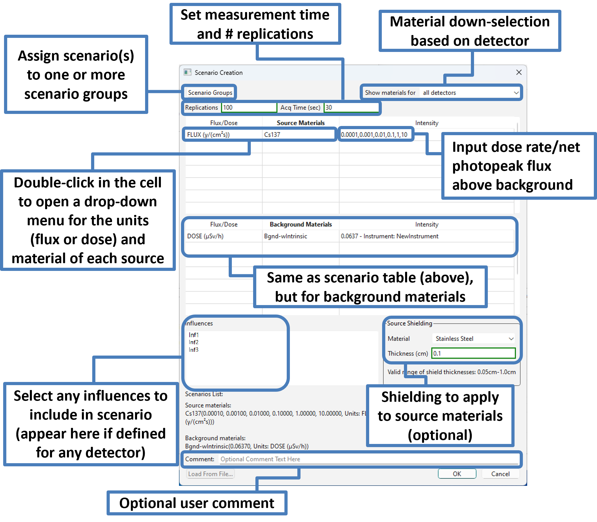
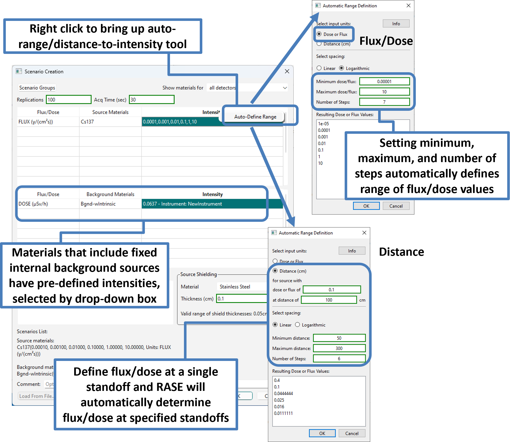

.. _workflowstep2:

###########################################
 RASE workflow step 2: Scenario definition
###########################################

Open the "Scenario Creation" dialog (figure below) by clicking the "Create Scenario" button
in the main RASE window.

Define a scenario by specifying source and background materials. Each material can be
expressed either as flux in a characteristic photopeak or as the net dose rate induced in
the detector by the source. Also specify the acquisition time to simulate, in seconds.
Source materials appear in the top table, and background materials in the bottom table.

When RASE creates sample spectra, it samples the base spectra of constituent materials
identically, whether a material is a source or a background.
The distinction is mainly bookkeeping to simplify plotting and analysis.
RASE also treats source and background materials the same when calculating isotope
identification results for a scenario, except when an isotopic material is specified in the
format XXnnn (rather than "Background" or "NORM") in the background table;
for more detail on this exception, see :ref:`workflowStep6`.

To add a material (usually a nuclide), double-click the second cell of the source or background
table. Select the desired entry from the drop-down list. Available options come from the
inventory of base spectra tied to the instruments you previously added.
If no instruments are defined, no materials will be available.

The leftmost column of each table indicates whether the material uses flux or dose-rate units.
When you select a material, RASE defaults to dose rate if a base spectrum for that material
defines a `rase_sensitivity` factor; otherwise it defaults to flux.

RASE prevents defining a material/units combination that the loaded base spectra do not support.
If you choose units before the material, only materials whose base spectra include the relevant
sensitivity factor will be offered.
If you select a material first and then change units to ones not available in that material's
base spectrum, the material selection will reset and you must choose a new material.

You can mix materials defined in units of flux and in units of dose rate
within a single scenario.

Enter the dose rate above background (:math:`{\mu}` Sv/h), or the flux in a key photopeak
(gammas/cm :sup:`2` s), for each material in the third cell of the table. The default value is
0.1 [:math:`{\mu}` Sv/h] / [gammas/cm :sup:`2` s] for flux/dose, respectively.
You can specify a range of dose rates or fluxes using the format [min]-[max]:[number of steps],
which produces one scenario for each value.
Right-click the dose rate/photopeak flux cell to open a dialog where you can set min, max,
number of steps, and choose linear or logarithmic spacing; RASE will then generate the range.

Use the same steps to define background sources and to enter their background
dose rate/flux (or a range of dose rates/fluxes).

Specify the acquisition time in seconds (default: 30 s).
You may enter a range using the same format as for dose rates: [min]-[max]:[step]

Set the number of replications (default: 100).
This determines how many sampled spectra RASE will create for the scenario.

Use the optional comment field to record any additional context.
Comments are searchable from the main window.

Scenarios can belong to groups to improve workflow organization.
Click the "Scenario Groups" button in the top-left of the scenario creation window to open a
dialog where you can define any number of groups the scenario(s) should belong to.
You can also create new groups from this dialog.
If you do not assign a scenario to any group, it is automatically placed in "default_group".
You can change a scenario's group membership at any time after creation.
A scenario does not need to remain in any group; removing it from all groups still preserves it
in "All Scenario Groups", selectable from the drop-down menu in the main window.

You can add shielding to a scenario by selecting a material from the drop-down menu and
specifying one or more thicknesses as a comma-separated list in units of [cm]. Detectors can
only run scenarios if the assigned DRF is compatible with the scenario's shielding. For example,
a detector without a DRF cannot run a scenario with shielding selected.

Shielding calculations use pre-determined matrices with discrete thicknesses. Matrix
interpolation is used for other thickness values. A note displays the range of pre-calculated
thicknesses for the selected material. Be cautious applying shielding that exceeds this range
by more than a factor of two, as extrapolated results may become unphysical. See
":ref:shielding_generation" for more details on applying shielding in RASE.

From the main window, right-click a scenario to access options such as edit,
delete, assign to a different group, or create a new scenario using the current one as
preset parameters (opens the scenario dialog).
You can select multiple scenarios and delete them or add them to groups together.
If all selected scenarios use the same materials, you can duplicate the set as a group
(provided you change at least one material, material intensity, or acquisition time on the
duplicates to avoid exact copies).
For example, if you created a range of scenarios for one material and want to test the same
dose values for a different material, select those scenarios in the main window,
choose the duplicate option, and change the single material on the copies.
This generates a new set of scenarios with the desired material.

|

.. _rase-workflowstep2:

   **Basic "Add Scenario" dialog.**

|

   **"Add Scenario" dialog with various additional features.**