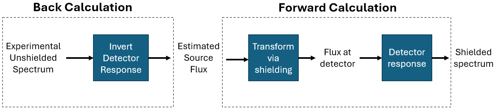
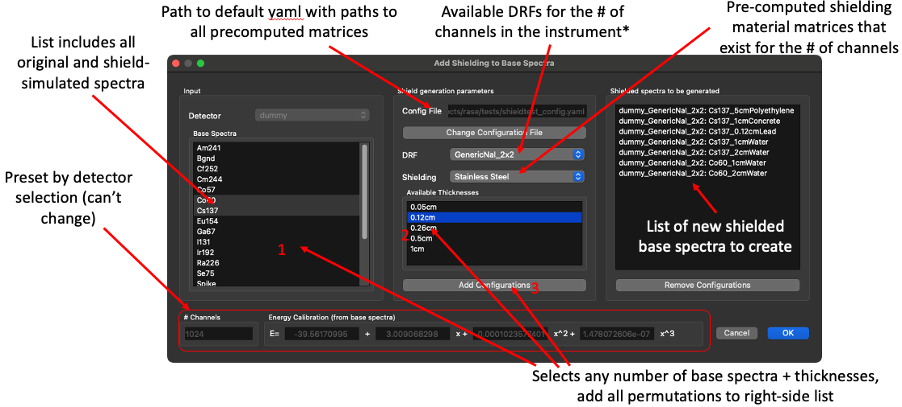
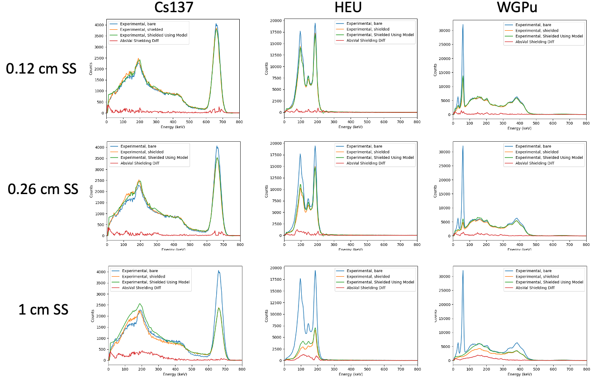

.. _shielding_generation:

##################################
 Shielded base spectra generation
##################################

RASE models shielding effects from a variety of materials and thicknesses by applying
pre-calculated shielding responses to unshielded base spectra. Matrices that capture detector
response to arbitrary gamma energies (and their matrix inverses) were generated for several
generic detectors using GADRAS, and were chosen to cover a range of detector materials, sizes,
and channel counts. The responses included in the release of RASE v3.0 are:

-  512 channel 1.5"(L)x14"(W)x70"(Depth) PVT, 5% FWHM
-  1024 channel 2"(Diam)x2"(Depth) NaI, 2.5% FWHM
-  1024 channel 2"(L)x4"(W)x16"(Depth) NaI, 2.5% FWHM
-  2048 channel 1"(Diam)x1"(Depth) LaBr, 0.87% FWHM
-  3000 channel 1.16"(L)x1.16"(W)x1.16"(Depth) CZT, 0.48% FWHM

Note that all resolutions are at 662 keV and are significantly better than real-world
counterparts; this improves unfolding of spectra from a wide range of instruments. Though
these responses cover a relatively narrow set of generic instruments, they approximate shielding
effects well for most detectors with a given channel count regardless of detector material or
size, provided that:

-  the energy resolution of the base spectra is the same or worse than the 662 keV energy
   resolutions quoted in the list above
-  the spectra do not demonstrate strong effects from the original measurement geometry

The matrices required for the shielding algorithm are distributed with RASE in two .zip files. They
should be unzipped into a directory of your choice, though by default RASE expects them in the
``C:\\RASE`` directory. Specify the path to the unpacked folder in the ``shielding_paths_config.yaml`` file
distributed with the RASE release. Point to that file in the shielding dialog.

..
   rase_shielding_workflow:

   **RASE shielding workflow.**

|

***************************
 Shielded spectra creation
***************************

Create shielded spectra using the dialog at "Tools->Shielded Base Spectra Creation" or from the detector
creation window via the "Create Shielded Spectra" button in the
top right corner. The dialog is available only when a detector has associated base spectra. Once
created, shielded spectra attach to the instrument in RASE like any other base spectrum. You may
add multiple shielding layers to a spectrum; this has not been experimentally validated, so proceed
with caution.

Shielding applies only to spectra with the same number of channels as the precomputed
matrices. They do not need a specific calibration to be compatible: RASE rebins the spectra, applies the
shielding algorithm, and then restores the original calibration. Consequently, you can add shielding
to only one instrument at a time; however, you may apply any number of thicknesses to any number of
sources for that instrument.

Spectra created via the shielding GUI have an asterisk (\*) appended to the name to
distinguish them from experimentally acquired shielded spectra.

Spectra can be exported as standard .n42 files by clicking the "Export All Configurations" button.

..
   rase_shielding_gui:

   **RASE shielding GUI.**

Oscillation suppression
=======================

When shielding is applied to spectra that do not closely match the assigned DRF, oscillations can
appear in the output spectra, especially at higher energies. RASE provides three methods to address
these oscillations:

*  None - No action is taken; any oscillations remain in the output shielded spectra.
*  Auto-Response Cancelling (default) - The algorithm detects oscillations caused by mismatches
   between the base spectrum and the DRF (for example, counts at lower energies than expected).
   The spectrum is divided into 25 groups with roughly equal channel counts. In each group except
   the first two (ignored to reduce artifacts), the algorithm subtracts detected oscillations from
   the shielded spectrum, scaled to the shielding level, to reduce artifacts.
*  Post-Peak Zeroing - The algorithm finds the bin with the highest count in the base
   spectrum, then locates the highest energy bin with either at least 10 counts or more than
   1/1000th of the peak bin’s counts (whichever is greater). All bins above this energy threshold
   are set to zero in the output shielded spectrum.

You are encouraged to perform a visual inspection of the output spectra to ensure no significant
artifacts are present. The oscillation reduction algorithm can be chosen in the RASE preferences
dialog, accessible via the main window.

!!!IMPORTANT!!!: Sensitivity factors and scenarios with shielded spectra
========================================================================

Unlike experimentally derived shielded spectra, RASE/FLUX sensitivity factors for shielded base
spectra created with the RASE tool are calculated using the dose rate/flux of the corresponding
*unshielded* spectrum. **This differs from how sensitivity factors are determined for experimentally
measured shielded spectra**, which use the dose rate/flux at the detector surface *after* shielding.
Using the unshielded dose rate/flux for RASE-generated shielded spectra avoids extra uncertainties
and does not require you to specify the photopeak energy used for the flux calculation.

Because of this difference, define and interpret scenarios that include RASE-created shielded spectra
in terms of the expected dose rate/flux at that location for the corresponding *unshielded* source.
If a RASE-generated shielded source and an unshielded source are both assigned the same flux, the
photopeak from the shielded source will have fewer counts than the unshielded source. (By contrast,
for an experimentally shielded spectrum, the shielded and unshielded sources would yield roughly the
same total photopeak counts at the same flux.) For direct comparisons between experimental and
RASE-generated shielded spectra, scale the dose rate/flux of the RASE-generated spectra by the
shielding attenuation factor to align them.

|

****************************
 Validation and limitations
****************************

The shielding approach has been experimentally validated to reproduce photopeak attenuation within
10% of experimental results for several commercial instruments under realistic steel and tungsten
configurations (0.05 cm to 1 cm). However, heavier shielding can produce scattering effects not
well reproduced in the modeled continuum, which can lead to significant divergence from experiment.
Keep this in mind if the algorithm under evaluation relies heavily on the continuum region of a
spectrum (for example, template matching), especially when using highly attenuating materials such
as uranium or large thicknesses of lower-attenuating materials such as steel or water.

Oscillations have been observed when applying shielding to spectra with a lower-level discriminator
above about 30 keV. Always spot-check generated spectra: minor oscillations are expected, especially
beyond the photopeak region. Do not use spectra that show substantial oscillations, including those
affecting photopeaks.

Neutron count rates are not adjusted by shielding in any way.

..
   rase_shielding_workflow:

   **Comparison between the RASE shielding algorithm and experimentally shielded spectra for a COTS NaI
   detector for various sources and thicknesses of stainless steel.**